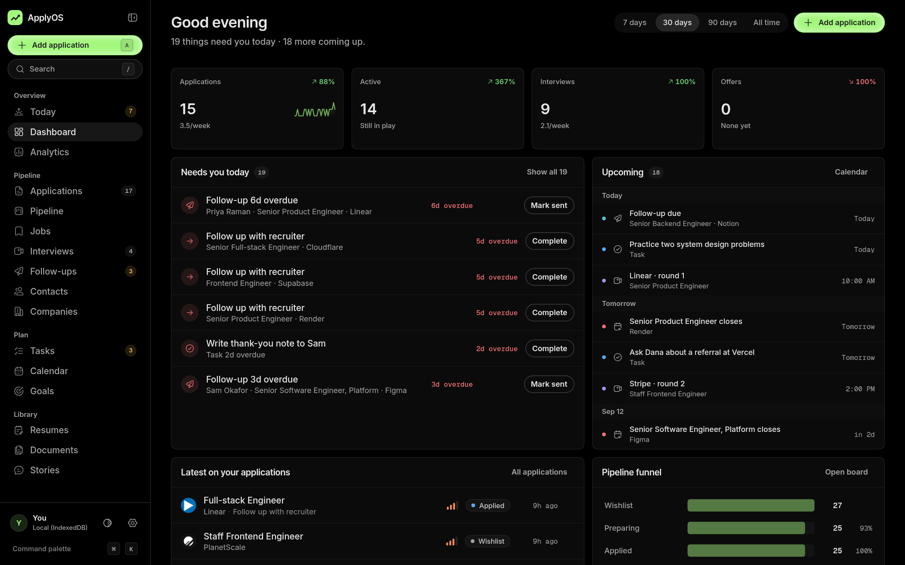
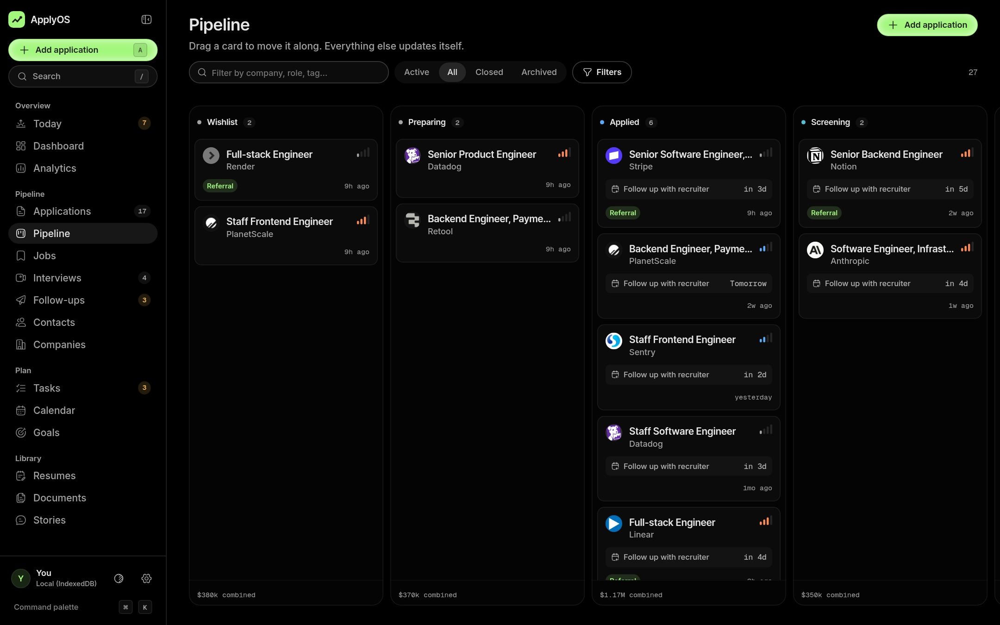
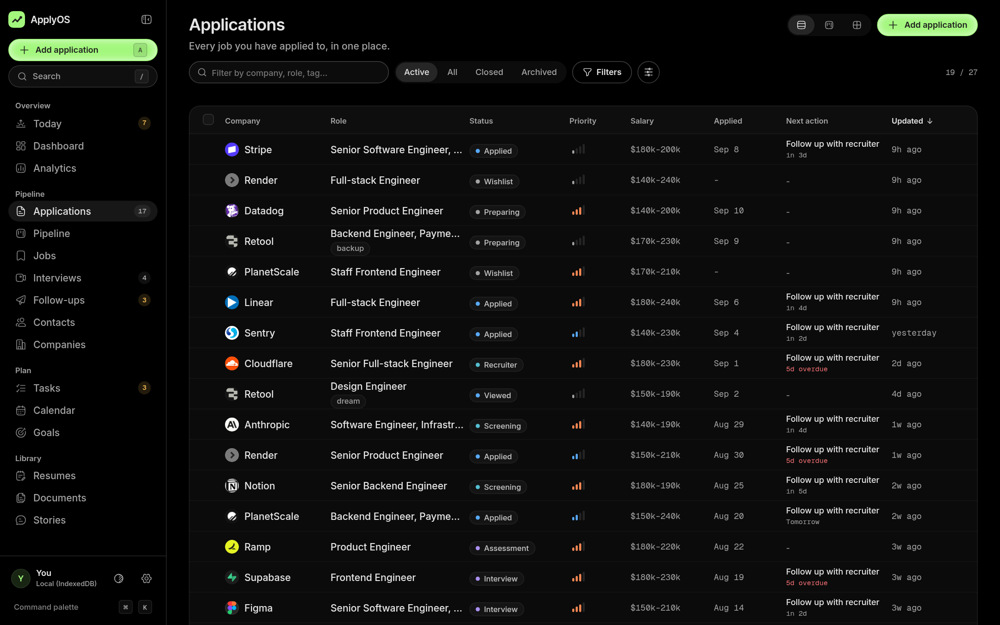
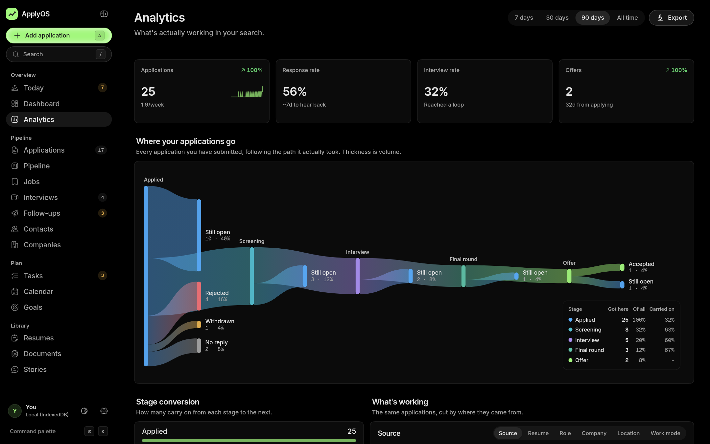
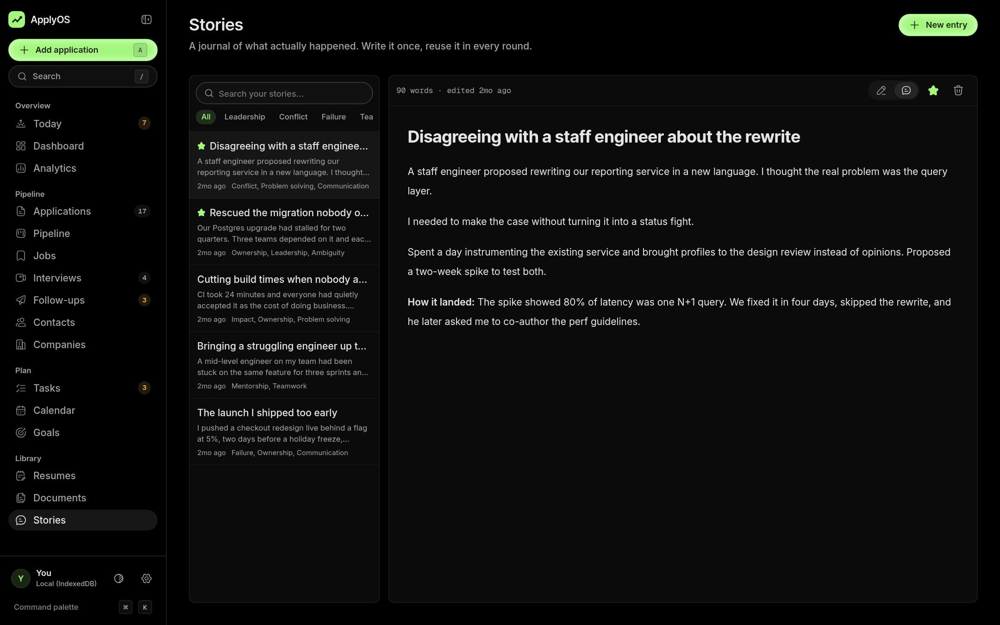
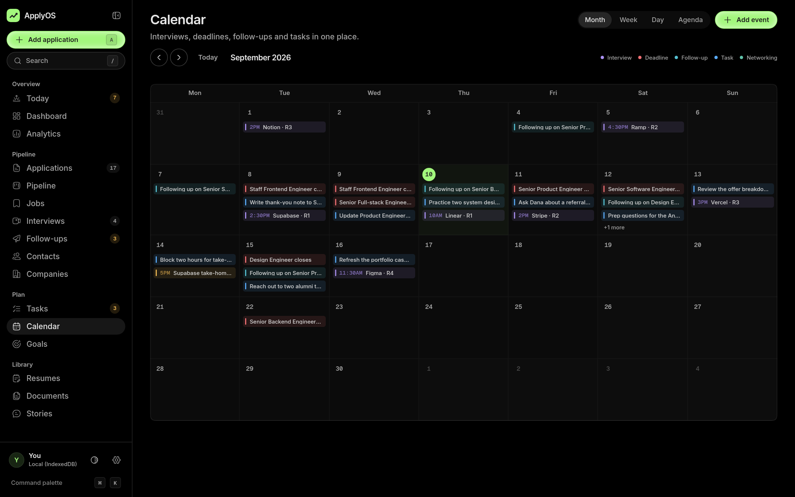
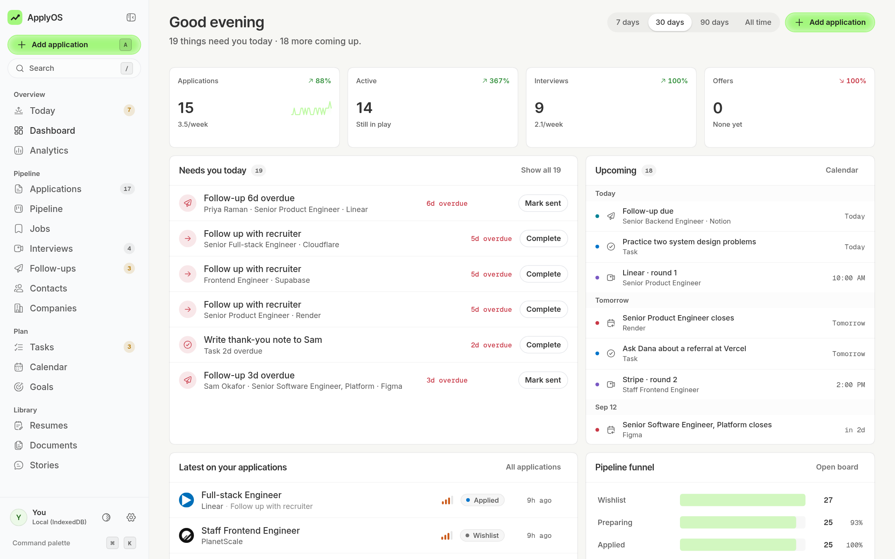

<div align="center">

# ApplyOS

**A personal operating system for the job hunt.**

Applications, interviews, follow-ups and the people behind them, in one place that
answers the only question that matters day to day: what do I do next?

Open source, runs in your browser, no account required.

</div>



## What it is

Most job searches are run on a spreadsheet that tells you what you typed and nothing
about what to do. ApplyOS is the other thing: a 22-screen workspace that tracks the
whole pipeline and surfaces the work. Overdue follow-ups, interviews tomorrow, offers
with a decision date, and the numbers that tell you which resume is actually getting
replies.

It runs entirely in your browser. There is no sign-up, no server, and nothing leaves
the machine unless you point it at a database you own.

## Screenshots

<details open>
<summary><b>The pipeline</b></summary>

Drag a card to move an application along. Every move writes an activity entry, sets
the dates, and schedules the next follow-up.



</details>

<details>
<summary><b>Applications table</b></summary>

Sorting, filtering, column customisation, inline editing and bulk actions, virtualised
so a long list stays smooth. Also available as a board or as cards.



</details>

<details>
<summary><b>Analytics</b></summary>

A Sankey of where every application actually went, rebuilt from the activity history
rather than the current status, so a rejection after a final round still flows through
every stage it passed.



</details>

<details>
<summary><b>The journal</b></summary>

A markdown vault for the stories you get asked about in every behavioural round.
`[[Wikilinks]]` and `@mentions` resolve to real records, `#tags` come from the note
itself, and task checkboxes write back into the source.



</details>

<details>
<summary><b>Calendar</b></summary>

Interviews, deadlines, follow-ups and tasks in month, week, day or agenda.



</details>

<details>
<summary><b>Light mode</b></summary>



</details>

## Features

**Pipeline**
- 14 stages from wishlist to accepted, with a board, a table and a card view
- Drag to move, with dates and follow-ups applied automatically
- A detail workspace per application: timeline, notes, contacts, documents, interviews
- Paste a job link and the company, role, source and work mode fill themselves in

**Interviews and follow-ups**
- A prep workspace per round: company research, likely questions, your story bank
- Follow-ups written now and scheduled for later, with an overdue view that nags

**People and companies**
- A lightweight CRM with full interaction history, as cards or as a table
- Company profiles with every application, contact and interview attached

**Library**
- Resume versions with PDF upload or a link, and reply rates per version
- Cover letters, portfolios and references, attachable to any application
- A markdown journal for behavioural stories

**Insight**
- A Sankey of the whole flow, stage conversion, and breakdowns by source, resume,
  role, company, location and work mode
- Rates are only reported once there is a real sample behind them

**The app itself**
- Command palette over everything, single-key adds, `G` chords to navigate
- Optimistic updates with undo on every destructive action
- Dark and light, responsive to phone widths, reduced-motion aware
- Everything exportable as JSON or CSV

## Quick start

```bash
bun install
bun dev
```

Open [localhost:3000](http://localhost:3000). The app lives at `/app`, and the
dashboard offers a demo workspace on first run so you can see a full search before
typing anything.

## Where your data lives

By default, in IndexedDB in your browser. Nothing is sent anywhere.

To sync across devices, point it at your own Supabase project:

```bash
cp .env.example .env.local
# set NEXT_PUBLIC_SUPABASE_URL and NEXT_PUBLIC_SUPABASE_ANON_KEY
```

Then run `supabase/migrations/0001_init.sql` against your database. The same models
move across unchanged.

> **Security.** ApplyOS has no authentication by design, because it is a single-user
> tool. With Supabase configured, anyone holding your anon key can read the workspace.
> That is fine for a personal instance and wrong for a shared one. The migration opens
> with that warning and shows the per-user RLS path if you need it. Uploaded files
> always stay local.

## Stack

| Concern | Choice |
| --- | --- |
| Framework | Next.js 16 (App Router) + React 19 |
| Language | TypeScript |
| Styling | Tailwind CSS v4, CSS-first, no config file |
| Components | shadcn/ui over Radix |
| Icons | Hugeicons, stroke-rounded |
| Animation | `motion` in the app, `gsap` on the landing page |
| Data | IndexedDB or Supabase, behind one adapter |
| Runtime | Bun |

## How it works

**The data layer.** Everything the UI renders comes from an in-memory store
(`lib/data/store.ts`). Mutations update memory and notify subscribers synchronously,
then flush to the adapter in the background, which is why navigation and inline edits
are instant and nothing spins. Reads go through `useSyncExternalStore`, and a
collection array is only replaced when that collection changes, so unrelated
components never re-render.

**One model, two backends.** The Supabase adapter converts field names generically
(`camelCase` to `snake_case` and back), so adding a field means adding a column and a
property, with no mapper in between.

**Job links.** `lib/job-url.ts` reads the structure of a URL. Greenhouse, Lever, Ashby,
Workable, SmartRecruiters, LinkedIn, Indeed, Wellfound and ordinary careers pages all
encode the company, and usually the role. It runs locally with no network request.

**Honest numbers.** Applications count by the date they were submitted, not the date
the row was created, so importing history does not spike this week. Rates are withheld
below four samples rather than reported as noise.

**AI is a seam, not a dependency.** `lib/ai/provider.ts` defines one narrow interface
covering resume analysis, JD summarising, question generation and email drafting. Every
method is optional and the UI degrades quietly when no provider is registered. Nothing
ships wired up, and no key is needed to run the app.

## Project structure

```
app/
  page.tsx              Landing page
  app/                  The product, one folder per screen
  api/capture/          Endpoint for a browser extension
components/
  ui/                   Primitives: button, dialog, checkbox, calendar, icons
  common/               Shared app pieces: tables, charts, forms, markdown
  <domain>/             Feature components
lib/
  data/                 Store, adapters, actions, seed
  analytics.ts          Summaries, funnels, trends, insights
  sankey.ts             The application flow
  job-url.ts            Link parsing
supabase/migrations/    The schema
scripts/                Headless browser QA
```

## Scripts

```bash
bun dev          # development server
bun run build    # production build
bun run lint     # eslint
bun run typecheck
bun run walk     # loads every route, fails on console or network errors
```

## Licence

MIT.
